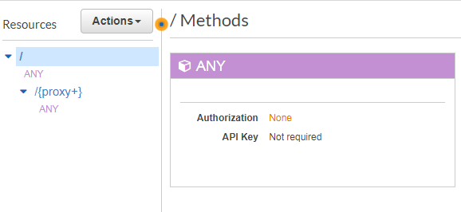
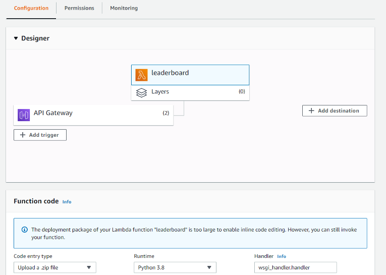

# About

Serverless (s3-sqlite) hosted django application (requires only s3, lambda, api gateway)
Inspired by:

https://blog.zappa.io/posts/s3sqlite-a-serverless-relational-database

https://github.com/logandk/serverless-wsgi


# Features
* supports entry of list of drivers and list of tracks
* supports one "best laptime" entry for each combination of driver and track
* administrator account (django admin) manages laptimes
* site visitors see laptimes displayed in tables, one table for each track
* index displays track list


# Future
* support multiple entries per track and driver
* support choice of car for each entry


# Build and deploy

* configure AWS environment (and aws cli)
* then:
```
./build.sh
./deploy_static.sh
```

## API Gateway config

Two endpoints are needed, both proxied directly to lambda.


The lambda function only needs 128MB and it's a really good idea to set the concurrency limit to 1.  The other settings are pictured.


